# auWin

auWin is a program with which you can easily change attributes of windows and do other things with windows. An introduction is [here](#introduction "Introduction").

## Preview

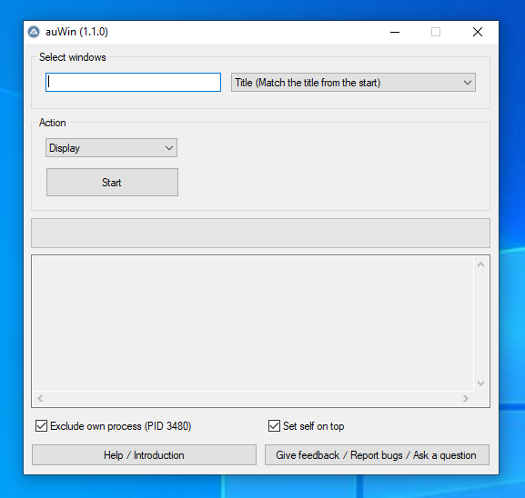

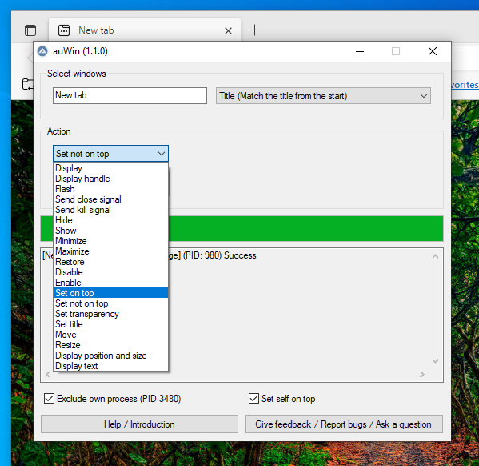

## Run

Download the standalone executable (`auWin.exe`) from [the last release](https://github.com/dodaucy/auWin/releases/latest "Last release") or run `auWin.au3` with [AutoIt 3](https://www.autoitscript.com/files/autoit3/autoit-v3-setup.zip "Download from autoitscript.com").

## Compile yourself

### Requirements

- [AutoIt 3](https://www.autoitscript.com/files/autoit3/autoit-v3-setup.zip "Download from autoitscript.com")

- [SciTE4](https://www.autoitscript.com/autoit3/scite/download/SciTE4AutoIt3.exe "Download from autoitscript.com")

### Compile

1. Right click `auWin.au3` and click on `Compile with Options`. The specified settings for the AutoIt3Wrapper are not loaded using the other options.

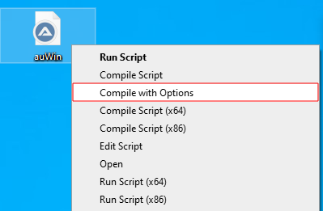

2. Now just click on `Compile Script`.

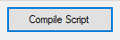

3. There is now an executable in the same folder as the `auWin.au3` file.

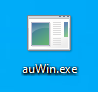

### Note

⚠️ The executable could be detected as malware. More information [here](https://www.autoitscript.com/forum/topic/34658-are-my-autoit-exes-really-infected/ "Forum post from autoitscript.com").

## Supported operating systems

- Windows XP and Windows Server 2003

- Windows Vista and Windows Server 2008/2008 R2

- Windows 7 / 8 / 10 / 11

Stand november 2022 - From the [AutoIt Downloads Overview](https://www.autoitscript.com/site/autoit/downloads/ "Downloads from autoitscript.com")

## Introduction

### Select windows

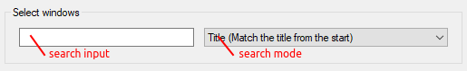

Select a *search mode* and enter something in the *search input*. This is how you select the windows that should be affected by an action.

⚠️ This also selects system windows. So be careful what you do with those windows!

#### Title (Match the title from the start)

In this mode, a window titled `Untitled - Notepad` will be selected by `Untitled - Notepad`, `Untitled`, `Un`, etc.

#### Title (Match any substring in the title)

In this mode, a window `titled Untitled - Notepad` will be selected by `Untitled - Notepad`, `Untitled`, `Notepad`, `pad`, etc.

#### Title (Exact title match)

In this mode, a window titled `Untitled - Notepad` will only be selected by `Untitled - Notepad`.

#### HWND / Window Handle (Get with 'Display handle')

In this mode, only a specific window will be selected. Each window has its own HWND. You can get the HWND with the [Display handle](#display-handle "Display handle") action. It can be useful when the window name changes. An example of a HWND is `0x00000000000802EC`.

#### PID / Process ID (In the brackets at 'Display')

In this mode, all windows from a specific process will be selected. You can get the PID with the [Display](#display "Display") action (the PID is in the brackets) or with the task manager. An example of an PID is `980`.

#### All windows

In this mode, all windows will be selectet. You can't enter anything in the *search input*.

#### Advanced

When have selected a title mode, you can use these properties instead of a title to select windows:

- `TITLE` - Window title
- `CLASS` - The internal window classname
- `REGEXPTITLE` - Window title using a regular expression
- `REGEXPCLASS` - Window classname using a regular expression
- `X` \ `Y` \ `W` \ `H` - The position and size of a window
- `INSTANCE` -  The 1-based instance when all given properties match

One or more properties can be used in the *search input* in the format: `[PROPERTY1 : Value1; PROPERTY2:Value2]`. If a Value must contain a `;` it must be doubled.

Here are some examples:

- `[CLASS:Notepad]` - All windows with the classname `Notepad`
- `[TITLE:My Window; CLASS:My Class; INSTANCE:2]` - The 2nd instance of a window with title `My Window` and classname `My Class`
- `[REGEXPTITLE:(?i)(.*SciTE.*|.*Internet Explorer.*)]` - All windows matching title defined by a regular expression

### Actions

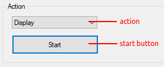

Select a *action* and then press the *start button*.

#### Display

Just lists all windows found. This can be used to test whether the windows are found or to get the PID wich can be used to [select windows](#pid--process-id-in-the-brackets-at-display "PID / Process ID (In the brackets at 'Display')"). An example of an PID is `980`.

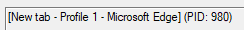

#### Display handle

Displays the HWND of the selected windows. This can be used to [select windows](#hwnd--window-handle-get-with-display-handle "HWND / Window Handle (Get with 'Display handle')"). An example of a HWND is `0x00000000000802EC`.

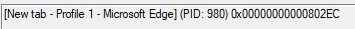

#### Flash

Flashes the selected windows until this window is selected.

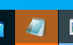

#### Send close signal

Sends a close signal to the selected windows. Some windows may ask for confirmation.

⚠️ Whether this signal is processed is entirely up to the program. The program could still continue. Use your task manager to kill a process.

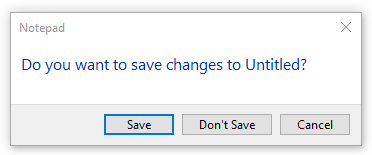

#### Send kill signal

Sends a kill signal to the selected windows.

⚠️ Whether this signal is processed is entirely up to the program. The program could still continue. Use your task manager to kill a process.

#### Hide

Hides the selected windows. These continue to run in the background but are no longer visible. Can be undone with [show](#show "Show").

#### Show

Shows the selected windows that were not previously visible. Can be undone with [hide](#hide "Hide").

#### Minimize

Minimizes the selected windows.

#### Maximize

Maximizes the selected windows.

#### Restore

Restores the selected windows. This is the third state next to [minimize](#minimize "Minimize") and [maximize](#maximize "Maximize"). The windows are visible but do not cover the entire screen.

#### Disable

Disables the selected windows. This means that you can no longer interact with the windows. Can be undone with [enable](#enable "Enable").

#### Enable

Enables the selected windows. After that you can interact with the windows again. Can be undone with [disable](#disable "Disable").

#### Set on top

Ensures that all selected windows always stay on top of other programs. Can be undone with [set not on top](#set-not-on-top "Set not on top").

#### Set not on top

Ensures that other windows can again be above the selected windows. Can be undone with [set on top](#set-on-top "Set on top").

#### Set transparency

Sets the transparency of all selected windows.

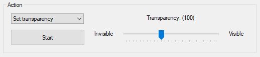

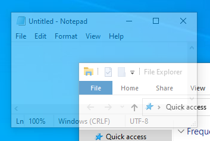

#### Set title

Sets the title of the selected windows.

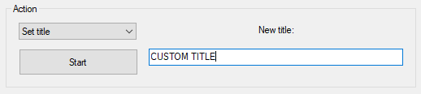

#### Move

Moves all windows to the given position. Windows can also be moved to a negative position.

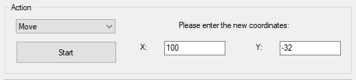

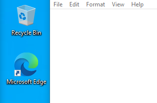

#### Resize

Changes the size of all selected windows.

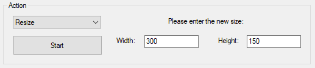

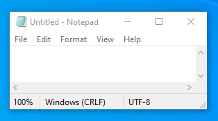

#### Display position and size

Displays the position and size of all selected windows in [the display](#the-display "The display").

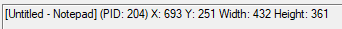

#### Display text

Displays the text of all selected windows in [the display](#the-display "The display").

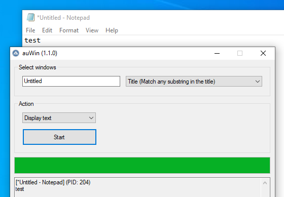

### Loading bar

This loading bar shows how far the progress of the current action is.

### The display

While auWin is running, the display shows the return value of the action for each window. The format for each window is this:

`[` Title `] (PID:` PID `)` Optional return value

The return value can be requested information such as the position and size of the window or whether the action was successful.

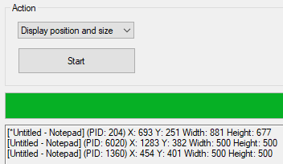

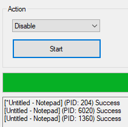

### Exclude own process

When activated, no actions are performed on itself.

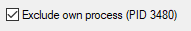

### Set self on top

If activated, auWin always stay on top of other programs.

## License

MIT

Copyright (C) 2022 dodaucy
