# auWin

auWin is a program with which you can easily change attributes of windows and do other things with windows. An introduction is [here](https://github.com/dodaucy/auWin#introduction "Introduction").

## Preview

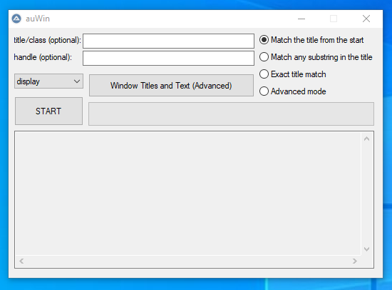

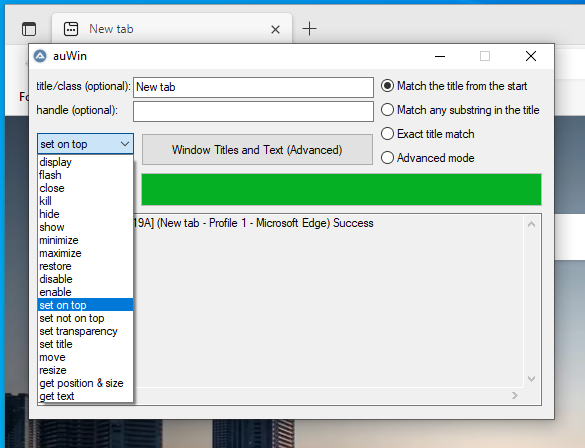

## Run

Run `auWin.au3` with [AutoIt 3](https://www.autoitscript.com/files/autoit3/autoit-v3-setup.zip "Download from autoitscript.com") or download the standalone executable from [the last release](https://github.com/dodaucy/auWin/releases/latest "Last release").

## Compile yourself

### Requirements

- [AutoIt 3](https://www.autoitscript.com/files/autoit3/autoit-v3-setup.zip "Download from autoitscript.com")

- [SciTE4](https://www.autoitscript.com/autoit3/scite/download/SciTE4AutoIt3.exe "Download from autoitscript.com")

### Compile

1. Right click `auWin.au3` and click on `Compile with Options`. The specified settings for the AutoIt3Wrapper are not loaded using the other options.

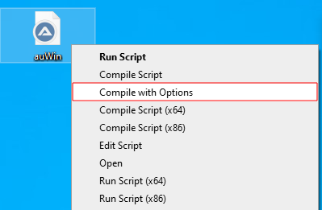

2. Now just click on `Compile Script`.

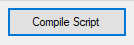

3. There is now an executable in the same folder as the `auWin.au3` file.

### Note

The executable could be detected as malware. More information [here](https://www.autoitscript.com/forum/topic/34658-are-my-autoit-exes-really-infected/ "Forum post from autoitscript.com").

## Supported operating systems

- Windows XP SP3

- Windows 2003 SP2

- Windows Vista

- Windows 2008

- Windows 7

- Windows 2008 R2

- Windows 8

- Windows 2012 R2

- Windows 10

- Windows 11

## Introduction

### Areas

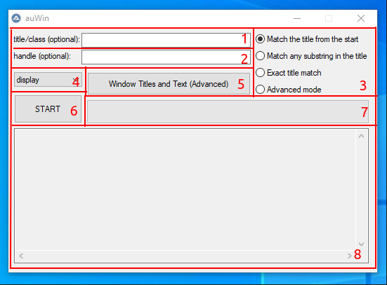

1. Simple search input

2. Handle search input

3. Win Title Match Mode

4. Action

5. Help button

6. Start button

7. Process bar

8. Display

### Basic search

Enter the title or a part of the title in the *simple search input* ([1](https://github.com/dodaucy/auWin#areas "Areas")) and select the appropriate *Win Title Match Mode* ([3](https://github.com/dodaucy/auWin#areas "Areas")). **If this field is left blank, all windows will be selected. This also applies to system windows. So be careful what you do with those windows!**

#### Examples

✅ Match

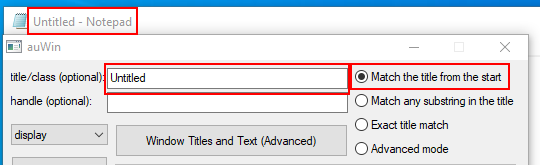

❌ Doesn't match

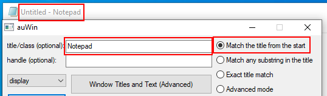

✅ Match

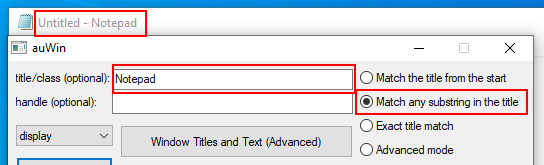

❌ Doesn't match

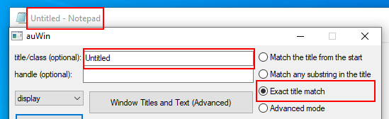

✅ Match

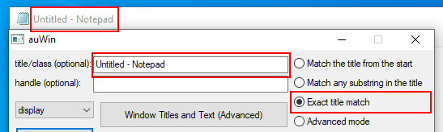

### Actions

Select the desired *action* ([4](https://github.com/dodaucy/auWin#areas "Areas")).

#### display

Just lists all windows found. This can be used to test whether the desired windows are found.

#### flash

Flashes the selected windows until this window is selected.

#### close

Sends a close signal to the selected windows. Some windows may ask for confirmation. **Whether this signal is processed is entirely up to the program! The program could still continue!**

#### kill

Sends a kill signal to the selected windows. **Whether this signal is processed is entirely up to the program! The program could still continue!**

#### hide

Hides the selected windows. These continue to run in the background but are no longer visible. Can be undone with [show](https://github.com/dodaucy/auWin#show "show action").

#### show

Shows the selected windows that were not previously visible. Can be undone with [hide](https://github.com/dodaucy/auWin#hide "hide action").

#### minimize

Minimizes the selected windows.

#### maximize

Maximizes the selected windows.

#### restore

Restores the selected windows. This is the third state next to maximize and minimize. The windows are visible but do not cover the entire screen.

#### disable

Disables the selected windows. This means that you can no longer interact with the windows. Can be undone with [enable](https://github.com/dodaucy/auWin#enable "enable action").

#### enable

Enables the selected windows. After that you can interact with the windows again. Can be undone with [disable](https://github.com/dodaucy/auWin#disable "disable action").

#### set on top

Ensures that all selected windows always stay on top of other programs. Can be undone with [set not on top](https://github.com/dodaucy/auWin#set-not-on-top "set not on top action").

#### set not on top

Ensures that other windows can again be above the selected windows. Can be undone with [set on top](https://github.com/dodaucy/auWin#set-on-top "set on top action").

#### set transparency

Sets the transparency of all selected windows. You can choose between the values ​`​0` (completely invisible) and `255` (completely visible). Here is an example with `100`:

#### set title

Sets the title of the selected windows.

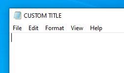

#### move

Moves all windows to the given position. Windows can also be moved to a negative position. As an example Y to `-32`:

#### resize

Changes the size all selected windows.

#### get position

Displays the position and size of all selected windows in the *display* ([8](https://github.com/dodaucy/auWin#areas "Areas")).

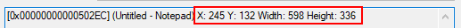

#### get text

Displays the text of all selected windows in the *display* ([8](https://github.com/dodaucy/auWin#areas "Areas")).

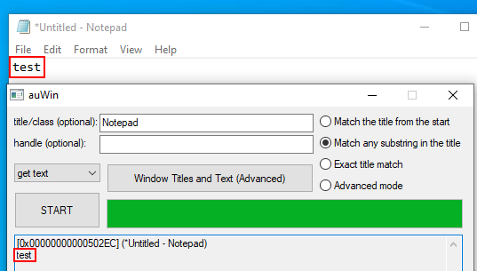
